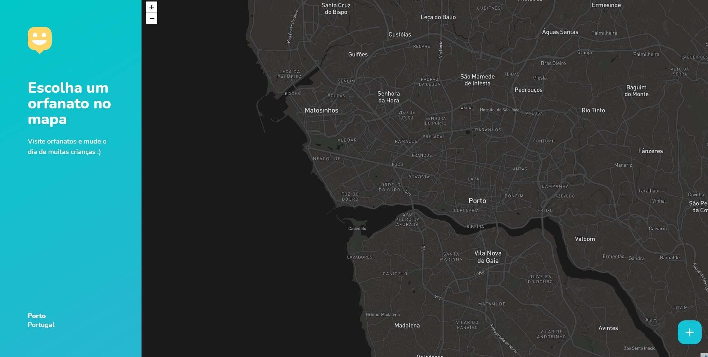

# Happy

  
  
  

## About this project

**Happy** is a project with the purpose of supporting the dissemination and visits to children-s-home, it is a platform where it is possible to register children-s-home on the user's city map, so that others who use them can discover the city's orphanages, visiting hours and operation.

## About this repository

This repo is focused on the Web's Front End code written in React.JS and Typescript.

<h2 align=center> Web Preview :computer:</h2>

## Technologies used

- [Typescript](https://www.typescriptlang.org/)
- [React](https://reactjs.org/)
- [Expo](https://expo.io/)
- [Express](https://expressjs.com/)

## :construction_worker: How to run

Before starting You wiil need Git, Node.JS, NPM and React.JS installed on your machine.

- First clone this repository:

`git clone https://github.com/ViniciusLagoGehrke/H.app.y-Web`

- Add a .env file on root folder with a REACT_APP_MAPBOX_TOKEN

- Then you can run locally:

`npm run start`

## Live Site

The Web version is already deployed and you can visite live here:

[Happy Web Porto](https://relaxed-elion-8d944c.netlify.app/app)

[OnPortfolio](https://front-end-portfolio.vercel.app/)
